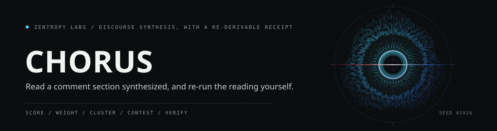

# chorus



Read a comment section the way you wish you could: not scrolled, but **synthesized**.

chorus takes a corpus of comments or threads and returns a weighted, clustered,
re-checkable reading of the discourse. It tells you the themes people are actually
voicing, ranks them by how much the crowd engaged and how strongly they felt,
surfaces the sharpest dissent instead of hiding it behind an average, and names the
topics the crowd is genuinely **split** on. Every digest carries a receipt a
stranger can re-run to get the same answer. Zero third-party runtime dependencies.

It orbits [gather](https://github.com/HarperZ9/gather): gather captures the corpus
with provenance, chorus synthesizes the discourse on top of it.

![Eight stages of turning a corpus of comments into a discourse digest: normalize, engagement, score, weight, cluster, themes, contested, and receipt. Gathered rows become discourse items, and rows that are not discourse are skipped. Engagement is read from the source when it is present; when a source genuinely has no signal, engagement is zero and the absence is recorded, so a missing vote is never counted as a real zero-weight one. Sentiment comes from a thirty word lexicon with negation, intensifier, capitalization and punctuation rules, and the same text always scores the same. Weight is the natural log of one plus engagement, multiplied by one plus half the sentiment intensity, so a loud comment nobody engaged with stays small. Clustering is a hashed TF-IDF cosine against the nearest leader across five hundred and twelve dimensions, seeded most-engaged first. Each theme carries its size, its sentiment split, its controversy, and the single highest-weight voice that disagrees with the majority. Contested aspects are measured separately across every comment that mentions a term, so a topic the corpus is split on survives the clustering that would file praise and complaint about it under different themes. The receipt hashes the inputs, the parameters and the digest body. Three outcomes: re-derived, rejected, and advisory only.](docs/art/synthesis-lane.svg)

## What you get

- **Themes, ranked.** Comments cluster into themes by what they say; each theme
  carries its size, an engagement-and-sentiment weight, a sentiment split, a
  *controversy* score (how divided and how strongly felt), and the single
  highest-weight voice that disagrees with the majority.
- **The contested topics, named.** A separate lens reports the aspects the corpus
  is genuinely split on, measured across *every* comment that mentions a topic. It
  is immune to the lexical clustering that would otherwise file "the battery is
  amazing" and "the battery is terrible" under different themes and hide the fight.
  One-sided praise and neutral chatter are excluded; only real two-sided
  disagreement is surfaced.
- **A receipt, not a vibe.** `--verify` re-derives the whole digest from the inputs
  and confirms it. A tampered digest fails even if its own hash was recomputed to
  match. Sentiment is a *weight*, never a verdict.
- **Honest nulls.** A missing engagement signal is recorded as absent, never
  counted as a zero. A too-thin corpus says so. The lexicon's limits (English-only,
  literal, no sarcasm) are stated in the digest itself.
- **A daemon.** Point it at a watchlist and it re-synthesizes only when a corpus
  actually changes, storing each receipted digest by its own hash.
- **An MCP surface.** Drive it from any MCP host: `chorus.run`, `chorus.corpora`,
  `chorus.digests`, `chorus.status`, `chorus.doctor`.

## Run it

```bash
pip install -e .

chorus run examples/discourse-sample.json --verify   # try it on the bundled sample
chorus run <corpus> --verify        # a corpus -> a verified discourse digest
chorus corpora <root>               # discover gather corpora as discourse sources
chorus watch add <corpus>           # add a corpus to the daemon watchlist
chorus daemon --interval 300        # poll the watchlist, synthesize on change
chorus digests <store>              # what the daemon has synthesized
chorus mcp                          # the MCP stdio server
```

`<corpus>` is a gather corpus directory (a folder holding `catalog.jsonl`) or a
JSON list of rows. Add `--model "<command>"` to `run` to overlay a model's read on
the comments the lexicon is least sure about; the overlay is provenance-tagged and
never enters the re-checkable core.

![Eight stages of verifying a discourse digest: receipt, version, vocabulary, inputs, rescore, recluster, rehash, and verdict. The receipt supplies the parameters and hashes the original run recorded. The method version has to still match, because a digest built under an older pipeline is not re-derivable under this one. The lexicon is hashed into the receipt, so editing the word list invalidates every digest that was built with the old one. The corpus hash is checked before any work is done. Then the stored sentiment is thrown away and every comment is re-scored from its own text, which is why fabricated sentiment cannot verify. Clustering and weighting re-run from the parameters the receipt recorded, not from the live defaults, so raising a default cannot silently break an already-versioned receipt. The digest body is rebuilt from that re-derivation and hashed. The verdict is one boolean with nothing taken on trust: a digest whose themes, weights or sentiment distribution do not follow from the inputs fails, even when its own stored hash was recomputed to match its tampered body. Three outcomes: verified, tampered, and no receipt.](docs/art/verify-lane.svg)

## The receipt

The digest's `receipt` binds the inputs, the method, and the result. `verify`
re-runs the deterministic pipeline (score, cluster, weight) from the same corpus
and checks the hash, so a dishonest digest cannot pass. Any model overlay is listed
separately with its own provenance and is excluded from that check: the parts a
stranger can re-derive and the parts that are model opinion are kept distinct, on
the record.

![Twelve rows covering every number a digest reports and where it comes from. The lexicon is thirty words, fifteen positive and fifteen negative, each carrying a valence between minus three and plus three, and the whole list is hashed into every receipt. Ten intensifiers are looked for up to three tokens back, widening or narrowing a valence. Nine negators flip a valence and keep about three quarters of its size, so a negation weakens a claim rather than erasing it. The compound score runs from minus one to one, the summed valence divided by the root of itself squared plus fifteen, so no single loud comment runs away with a theme. Two emphases apply: an all-caps valence word of more than one letter counts a quarter more, and up to four exclamation marks add five percent each. Weight is the log of one plus engagement, times one plus half the sentiment intensity. Clustering runs a hashed TF-IDF cosine over five hundred and twelve dimensions against the nearest leader, joining above eighteen hundredths, seeded most-engaged first. Controversy is the population standard deviation of a theme's sentiment, zero at consensus and near one at a hard split. Twelve contested aspects are surfaced, each needing three mentioning voices and real disagreement on both sides. The receipt carries seven fields. The accented row is the model overlay, which is advisory opinion on the items the lexicon is least sure of and is deliberately kept outside the digest hash. The last row is engagement coverage, which reports how many items actually carried a signal, because an absent signal is recorded absent rather than counted as a zero.](docs/art/method-table.svg)

## Design

The design and its two exposed defects-caught-in-review live in
[docs/superpowers/specs](docs/superpowers/specs). Sentiment is coarse by
construction and the digest says so; clustering is lexical, not semantic. chorus
tells you what it did and hands you the means to check it.

## License

Source-available under the Functional Source License (FSL-1.1-MIT) (see [LICENSE](LICENSE)):
read it, run it, build on it; commercial use that competes with the project is
reserved.

---

**[Zentropy Labs](https://github.com/ZentropyLabs-ai)** · order out of entropy. An independent lab building evidence-first tools that leave a re-checkable artifact behind. Built by Zain Dana Harper in Seattle. The full workbench is at [Project Telos](https://harperz9.github.io).
